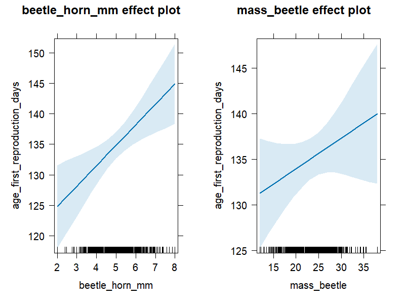
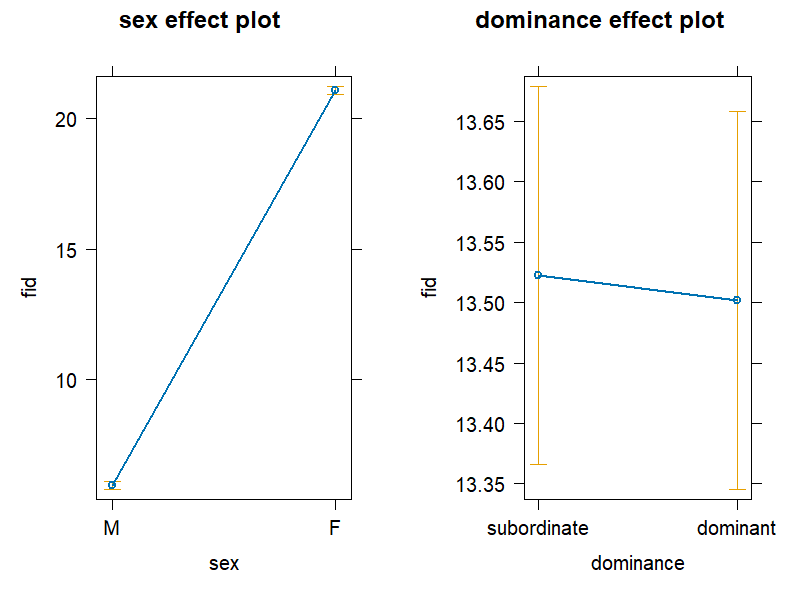
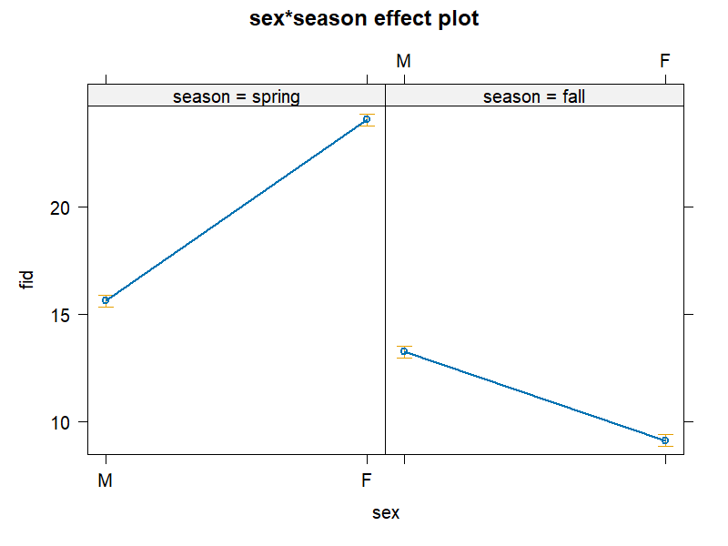

# BioData-Linear-Models: Statistical Modeling of Biological Data in R

## Context
This project was developed as part of the "Statistics for Biologists using R" course at the University of Göttingen. The goal was to master the application of multiple linear regression and interaction modeling on real-world biological datasets.

## Overview
This repository contains a series of reproducible R workflows for analyzing biological datasets using **Multiple Linear Regression**. The scripts demonstrate how to transition from raw biological data to statistically sound, publication-ready visualizations.

The workflows cover morphological traits (e.g., insect mass and reproductive age) and behavioral ecology (e.g., flight initiation distances in mammals), applying rigorous statistical checks at each step.

## Technical Workflows Included
1. **Continuous Variables (`01_Continuous_Regression.Rmd`)**
   - Regression modeling using continuous predictors.
   - Predicting age at first reproduction based on morphological mass.
2. **Categorical Variables & Dummy Coding (`02_Categorical_Regression.Rmd`)**
   - Handling non-numeric predictors (e.g., sex, dominance hierarchies).
   - Releveling factors and setting reference categories.
3. **Interaction Terms (`03_Interaction_Effects.Rmd`)**
   - Modeling complex biological realities where variables depend on one another (e.g., the interaction between Sex and Season on behavioral traits).

## Tech Stack & Packages
* **Language:** R
* **Data Manipulation:** Base R, factors management
* **Statistical Modeling and Data Visualization:** `lm()`, `car`, `effects`, `psych`, `ggpubr`, `lmtest`

## Key Competencies Demonstrated
* Implementation of dummy coding and reference releveling for multi-level categorical variables.
* Rigorous diagnostic testing for model assumptions (Normality, Homoscedasticity, Multicollinearity) and influential outlier detection (Cook's Distance, DFBETAS).
* Creation of publication-quality effect displays featuring confidence bands to accurately visualize main effects and complex interaction terms.

## Installation & Usage
To run these workflows locally on your machine:

1. **Clone the repository:**
   
   ````bash
   git clone (https://github.com/yazalj/BioData-Linear-Models.git)
   cd BioData-Linear-Models
   ````
   
3. **Prerequisites:**
   
   Ensure you have R and RStudio installed.
   
4. **Install Dependencies:**
   
   The scripts utilize the `pacman` package manager for clean environment setup. You only need to install `pacman` directly; it will automatically install and load all other required packages when you run the scripts.

   ````bash
   install.packages("pacman")
   ````
   
5. **Execution:**

   - Open any of the .Rmd files located in the scripts/ directory using RStudio.

   - Click the "Knit" button in RStudio. This will automatically execute the code, source the datasets from the data/ folder via relative paths, and generate a clean HTML report.


<table>
  <tr>
    <td align="center">
      
      <br />
      <sub><b>Continuous Variables</b></sub>
    </td>
    <td align="center">
      
      <br />
      <sub><b>Categorical Variables</b></sub>
    </td>
    <td align="center">
      
      <br />
      <sub><b>Interactions</b></sub>
    </td>
  </tr>
</table>
